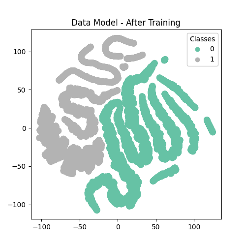
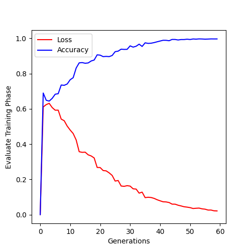

# 🌟 Neural Network with Genetic Algorithm Training 🌟
## This project focuses on training neural networks using a genetic algorithm approach.

### 📚 **Documentation**
_For a detailed explanation of the project, its architecture, and its features, please refer to our [**Report**](link-to-report)._

### 🎥 **Demo**
_A video demonstration is available to help you understand how to run and utilize the program effectively. You can watch it [**here**](https://www.youtube.com/watch?v=X45aitACju0)._

> **Note**: Both the report and the video demonstration are available in Hebrew, as this project was a part of an assignment submitted in that language.

### 🚀 **Quick Start**
_If you'd like to try out the program, an executable version is available for download from this [**Google Drive link**](https://drive.google.com/drive/folders/1IJQXZ8kennlluNSdHSD-fuaQ_BIYOo8H?usp=drive_link)._

### 📊 **Visual Results**
#### t-SNE Visualization Before Training

#### t-SNE Visualization After Training

